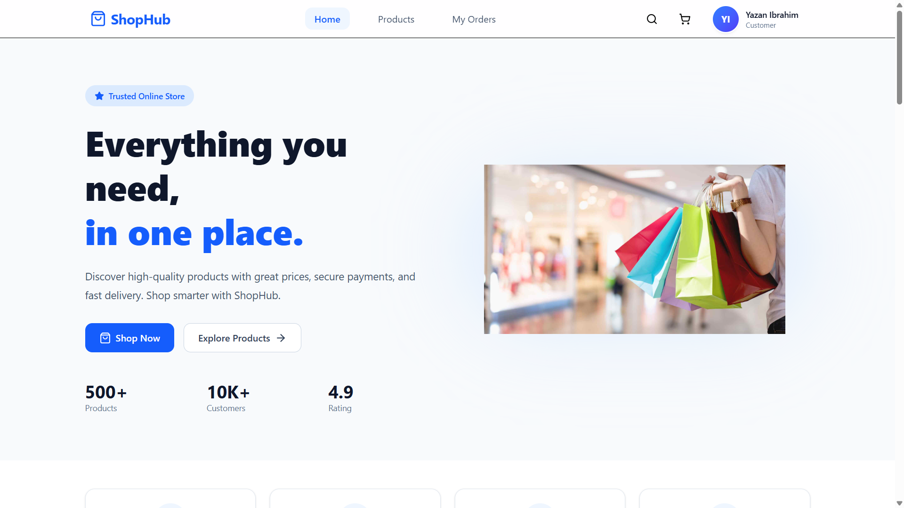
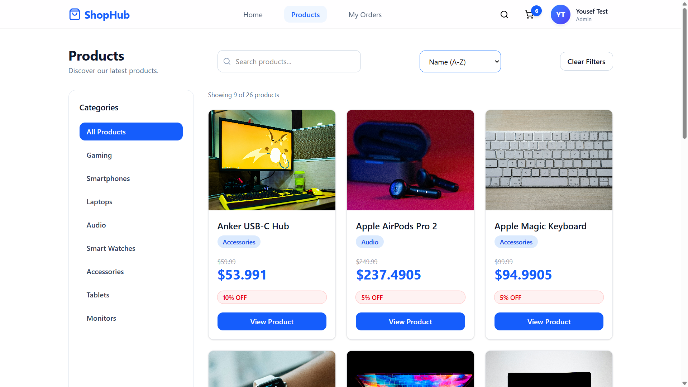
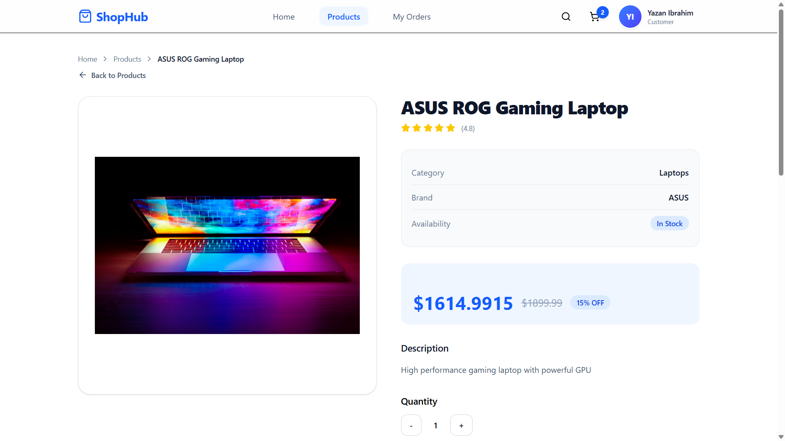
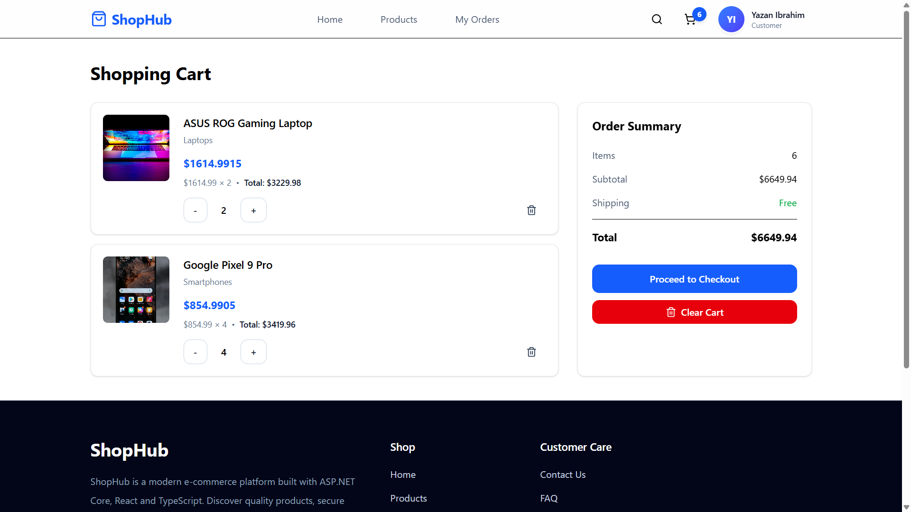
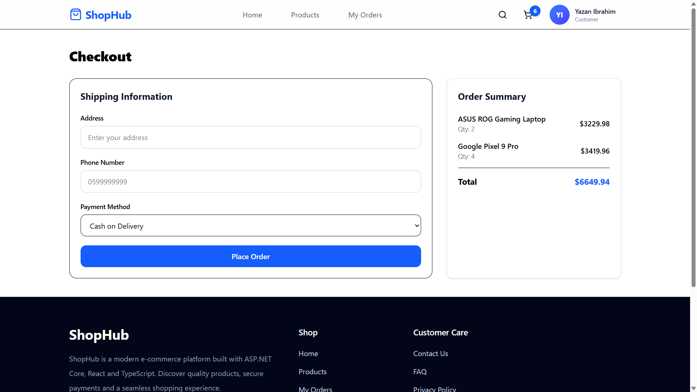
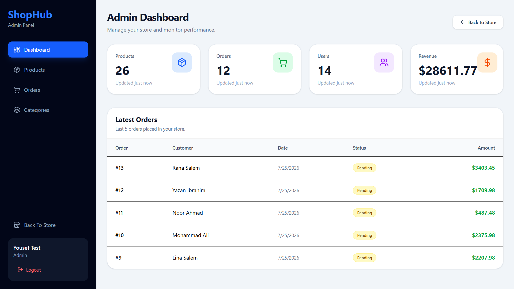
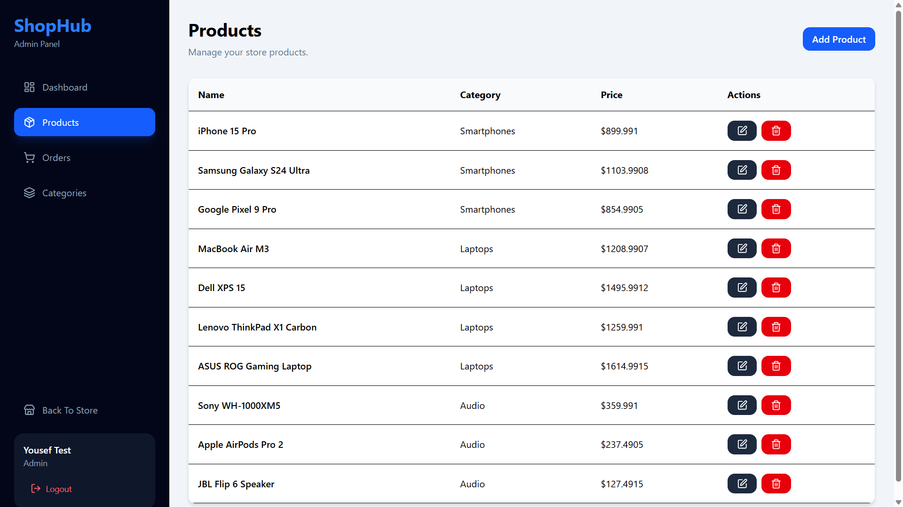
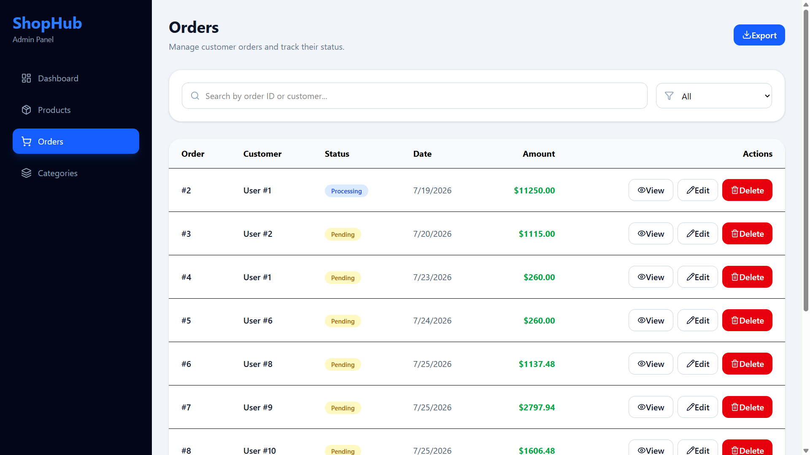
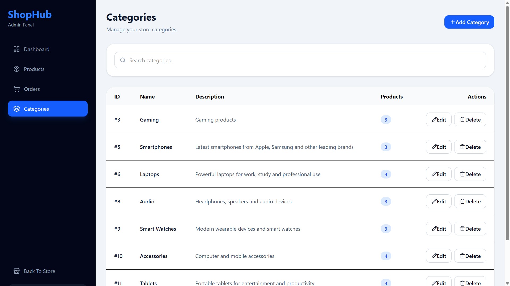

# 🛍️ ShopHub

A modern **Full-Stack E-Commerce Platform** built with **ASP.NET Core 10** and **React 19** following **Clean Architecture** principles.

ShopHub provides a complete shopping experience for customers and a powerful administration dashboard for managing products, categories, and orders.

---

# ✨ Features

## 👤 Customer

- JWT Authentication
- Register & Login
- Product Catalog
- Product Details
- Search Products
- Filter by Category
- Sorting
- Shopping Cart
- Checkout
- Order History
- User Profile

---

## 👨‍💼 Admin

- Dashboard
- Products Management
- Categories Management
- Orders Management
- Store Statistics

---

# 🏗 Architecture

Backend follows **Clean Architecture**

```text
ShopHub
│
├── ShopHub.API
├── ShopHub.Application
├── ShopHub.Domain
├── ShopHub.Infrastructure
└── shophub-client
```

---

# 🛠 Tech Stack

## Backend

- ASP.NET Core 10
- Entity Framework Core
- SQL Server
- Clean Architecture
- Repository Pattern
- JWT Authentication
- FluentValidation

## Frontend

- React 19
- TypeScript
- Vite
- Tailwind CSS
- TanStack Query
- Zustand
- React Router
- Axios

---

# 📸 Screenshots

| Home                             | Products                             |
| -------------------------------- | ------------------------------------ |
|  |  |

| Product                                     | Cart                             |
| ------------------------------------------- | -------------------------------- |
|  |  |

| Checkout                             | Dashboard                             |
| ------------------------------------ | ------------------------------------- |
|  |  |

| Admin Products                             | Admin Categories                             |
| ------------------------------------------ | -------------------------------------------- |
|  |  |

| Admin Orders                             |
| ---------------------------------------- |
|  |

---

# 💾 Database

- SQL Server
- Entity Framework Core Migrations

---

# 🚀 Getting Started

## Backend

```bash
cd ShopHub.API

dotnet restore

dotnet ef database update

dotnet run
```

Backend runs on:

```
https://localhost:5146
```

---

## Frontend

```bash
cd shophub-client

npm install

npm run dev
```

Frontend runs on:

```
http://localhost:5173
```

---

# 🔐 Authentication

- JWT Authentication
- Role-based Authorization
- Customer & Admin Roles
- Protected Routes

---

# 📁 Project Structure

```text
ShopHub
│
├── ShopHub.API
├── ShopHub.Application
├── ShopHub.Domain
├── ShopHub.Infrastructure
│
├── shophub-client
│   ├── features
│   ├── components
│   ├── hooks
│   ├── layouts
│   ├── app
│   └── utils
│
└── assets
    └── screenshots
```

---

# 🔮 Future Improvements

- Online Payment Integration
- Product Reviews
- Wishlist
- Email Notifications
- Image Upload
- Dashboard Analytics
- Docker Support
- CI/CD Pipeline

---

# 👨‍💻 Author

**Yousef Salman**

Computer Engineer

Frontend & ASP.NET Core Developer
